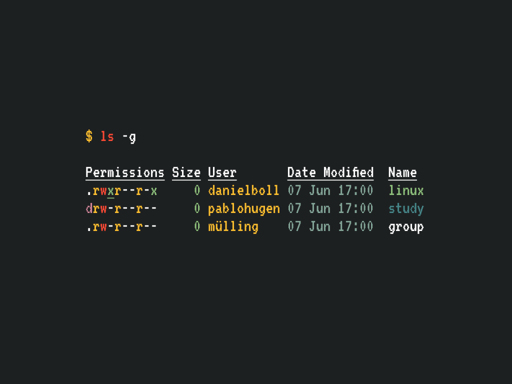
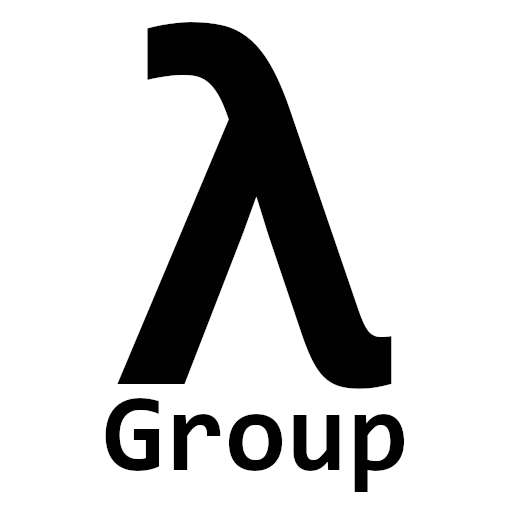

# $ ls -g
> A Linux Study Group that aims to go through the LFS (Linux From Scratch) book to understand better all components of the Linux kernel/system environment.

<p align="center">
       
</p>

<!-- TODO: Será que precisa do vídeo? fica meio poluído... -->
<!--
# Manifest

[](https://asciinema.org/a/0LuHj5Ei6f0lUBmS2WrXQ5GFc)
-->

```
LSG(7)                 Miscellaneous Information Manual                 LSG(7)

NAME
       lsg - linux study group

SYNOPSIS
       WHERE: LRC/LSC (Sala 6)

       WHEN: A partir de 14/06, toda terça 17h

       WHY: Estudar tópicos relacionados ao Linux

DESCRIPTION
       Com  o  objetivo  de  aumentar o entusiasmo sobre o sistema operacional
       Linux em nosso curso, nós resolvemos criar o `ls  -g`,  o  Linux  Study
       Group.

       Teremos  encontros  semanais,  que  acontecerão toda terça feira 17h, a
       partir de 14 de Junho, no laboratório LRC/LSC (Sala 6).

       Em cada encontro serão abordados aspectos do linux  como  compiladores,
       ferramentas  de  build, bootloaders, init systems, shell scripting, in‐
       terfaces gráficas, e muito mais.

       Além disso, no decorrer desses encontros  faremos  nossa  própria  dis‐
       tribuição  linux  do zero, desde o código fonte até a interface gráfica
       para que possamos aplicar todos esses conceitos vistos.

       Para que voce possa participar do `ls -g`, é recomendado um  computador
       com uma distribuição linux.

       Participem, será uma experiência única!

USAGE
       Venha ao laborátio LRC/LSC (Sala 6)

AUTHORS
       Written by Daniel Boll, Lucas Mülling, and Pablo Hugen.

SEE ALSO
       @pablo.hugen

       @lucas.mulling

       @damnboy_bot

                                      lsg                               LSG(7)
```

# Topics

### Background on \*NIX operation systems.

- [History of UNIX @ Bell Labs](https://www.youtube.com/watch?v=tc4ROCJYbm0)
- [History of Linux](https://www.youtube.com/watch?v=s7u7jBwIocU)

```
Hello everybody out there using minix -

I'm doing a (free) operating system (just a hobby, won't be big and
professional like gnu) for 386(486) AT clones.  This has been brewing
since april, and is starting to get ready.  I'd like any feedback on
things people like/dislike in minix, as my OS resembles it somewhat
(same physical layout of the file-system (due to practical reasons)
among other things).

I've currently ported bash(1.08) and gcc(1.40), and things seem to work.
This implies that I'll get something practical within a few months, and
I'd like to know what features most people would want.  Any suggestions
are welcome, but I won't promise I'll implement them :-)

              Linus (torvalds@kruuna.helsinki.fi)

PS.  Yes - it's free of any minix code, and it has a multi-threaded fs.
It is NOT protable (uses 386 task switching etc), and it probably never
will support anything other than AT-harddisks, as that's all I have :-(.
```

### What is The Kernel?

> The kernel is a computer program at the core of a computer's operating system and generally has complete control over everything in the system. It is the portion of the operating system code that is always resident in memory, and facilitates interactions between hardware and software components. A full kernel controls all hardware resources (e.g. I/O, memory, cryptography) via device drivers, arbitrates conflicts between processes concerning such resources, and optimizes the utilization of common resources e.g. CPU & cache usage, file systems, and network sockets. On most systems, the kernel is one of the first programs loaded on startup (after the bootloader). It handles the rest of startup as well as memory, peripherals, and input/output (I/O) requests from software, translating them into data-processing instructions for the central processing unit.

Source: Wikipedia contributors. "Kernel (operating system)." Wikipedia, The Free Encyclopedia. Wikipedia, The Free Encyclopedia, 21 May. 2022. Web. 3 Jun. 2022.

<!-- Essa parte da para falar em um encontro, falar mais por cima mesmo... -->
### The Linux Kernel!

Quick introduction to the Linux kernel. We wont spend much time here since most topics are covered in the Operating Systems class.

- Disk, USB and graphical controllers;
- Hardware and software Interrupts;
- Hardware timers;
- Kernel structures (Lists, Stack and Queues);
- Kernel and User space;
- Syscalls;
- Real time and Preemptive Scheduler;
- Threads Processes and Tasks;
- How the code in the Linux Kernel source code is structured;
- Architectures;
- Drivers and Modules;
- [The nightmare of Linux Firmware](https://www.youtube.com/watch?v=rFm9muwlJhg).
<!-- Pertinente a engenharia de software dá para falar como o Kernel é desenvolvido, patches, mailing lists e tal... -->

### Tooling.

- [GNU/make](https://www.youtube.com/watch?v=WFLvcMiG38w);
- Coreutils and basic commands;

### Building the Kernel.
- How to build the Kernel;
- Real time vs Preemptive scheduler.

<!--
### Making our own drivers and modules!
- TODO:
-->

### Linux as in GNU/Linux.
- Here we talk about GNU coreutils, init systems, graphical environments, the shell and every thing needed to make a working Linux distribution.

<!-- Talvez seja melhor seguir a branch de dev... -->
### Going Through LFS!
- [Linux From Scratch Book](https://www.linuxfromscratch.org/lfs/view/stable/).

---

<p align="center">
       
</p>
